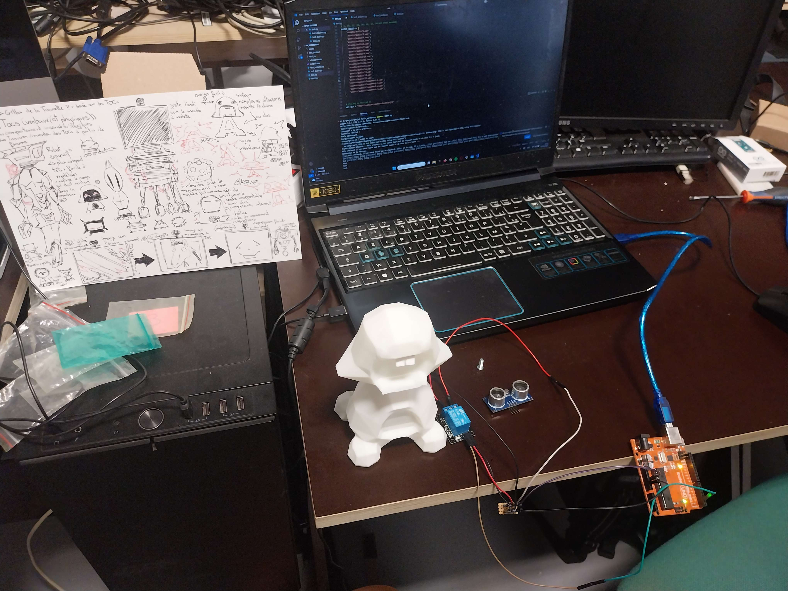
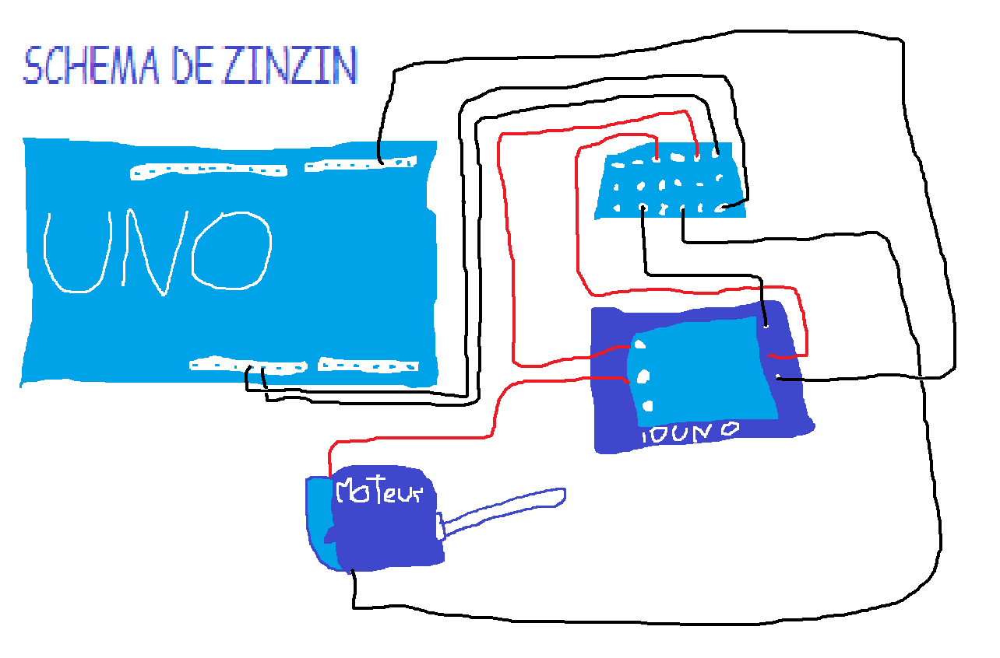

# 🚀 IA Hackathon Project

Welcome to **IA Hackathon Project**! About
This project was made as part of a collaboration between **42 school** and **Lazada art school**. The goal was to make an AI with **psychiatric problems** in pairs. So we decided to make a child with tics. 🎯



## 📌 Features  
✅ Motor activation based on python request

✅ Request to mistral API

✅ Talk to text

✅ Text to talk


---

## 🛠️ Required Components
| Component       | Quantity |
|-----------------|----------|
| Arduino Uno     | 1        |
| Motor           | 1        |
| Relais Arduino  | 1        |
| Wires           | Several  |

---

## ⚙️ Wiring Diagram
Here’s how to connect the components:  



📌 **Explanation:**  
1. Connect the GND and NO (Normally Open) pins of the relay to the GND pin of the Arduino board.
2. Connect the CVV pin of the relay to the D2 pin of the Arduino.
3. Connect the NC (Normally Closed) pin of the relay to the GND pin of the motor.
4. Connect the 5V pin of the motor and the SING pin of the relay to the 5V power supply.

---

## 🖥️ Installation
1️ Clone this repository:
```sh
git clone https://github.com/user/my-arduino-project.git
```

2 follow the diagram for the connections

3 update motor.ino in arduino card and close the IDE Arduino (for resolve Serial problem)

4 Install all lib :
```sh
pip install requests openai-whisper sounddevice numpy soundfile pyttsx3 pygame pyserial
```

5 Replace MY_API_KEY and COM_OF_THE_ARDUINO in main.py

6 Run main.py
```sh
python main.py
```


